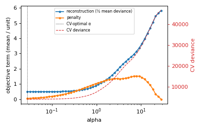

# jaxGLM

**GPU-accelerated elastic-net GLM for neural encoding.** A full pipeline — from event-kernel
design matrix to cross-validated, significance-tested encoding kernels — that fits **all units in
a session at once** on a single GPU. Supports **Poisson** (spike counts) and **Gaussian**
(continuous signals, e.g. fiber photometry) responses.

> **Status: research code, but the pipeline is complete and validated.** The solver and the
> encoding/significance drivers are implemented and tested on synthetic data and reproduced
> against published references on real public datasets (see [Validation](#validation)).

---

## Pipeline at a glance

| module | what it does |
|---|---|
| [`design.py`](design.py) | **Bin** raw spike/event/signal times onto a grid (`bin_spikes`, `events_from_times`, `resample_continuous`), build a **shift-kernel design matrix** `X` (`build_design`), and parse fitted weights back into per-predictor kernels (`kernels_from_weights`). |
| [`poisson_glm.py`](poisson_glm.py) | The **GPU solver**: batched elastic-net GLM fit over all units (FISTA), `family="poisson"`/`"gaussian"`, deviance / D² / R², and the objective decomposition (`objective_terms`). |
| [`encoding.py`](encoding.py) | The **encoding model**: data-driven `alpha_grid`, per-unit CV λ (`cv_select_alpha`), held-out subset **ΔD²** (`predictor_importance`), **significance** (`wilcoxon_full_vs_null`, `permutation_null_d2`), and the **regularization path** (`regularization_path`). |
| [`viz.py`](viz.py) | **Plots**: kernels vs lag, predicted-vs-actual reconstruction, event-aligned averages, and the regularization-scale figure (`plot_regularization_path`). |

A typical end-to-end run:

```python
import jax.numpy as jnp
import design as dz, poisson_glm as pg, encoding as enc, viz

# 1. bin raw times onto a grid (bin_width in SECONDS), then expand events into shift-kernels
t0, bin_width, n_bins = 0.0, 0.02, 60_000                              # 20 ms bins
Y = dz.bin_spikes(spike_times, spike_units, n_units, t0, bin_width, n_bins)   # (n_bins, n_units) counts
stim   = dz.events_from_times(stim_times,   t0, bin_width, n_bins)
reward = dz.events_from_times(reward_times, t0, bin_width, n_bins)
X, names = dz.build_design({"stim": stim, "reward": reward}, shifts=range(-10, 30))  # bin lags

# 2. fit every unit at once  (family="gaussian" for photometry)
Xz, mean, std = pg.standardize(jnp.asarray(X))
W, b, _, _ = pg.fit_units(Xz, jnp.asarray(Y), 0.01, 0.5, family="poisson")

# 3. predictor importance (held-out ΔD²) and significance — data-driven alpha grid, CV per unit
alphas = enc.alpha_grid(Xz, jnp.asarray(Y), l1_ratio=0.5)         # log-spaced from alpha_max down
imp = enc.predictor_importance(X, Y, subsets={"stim": [...], "reward": [...]}, alphas=alphas)
sig = enc.permutation_null_d2(X, Y, alphas=alphas)                # per-unit p-values

# 4. plot the fitted kernels
viz.plot_kernels(W, names, dt=0.02, mean_sem=True).savefig("kernels.png")
```

## Installation

Builds are heavy, so they run as SLURM jobs on a GPU node, not on a login node:

```bash
sbatch install_env.sh          # creates conda env `jaxGLM` (jax[cuda12] + optax + sci stack)
```

The script routes package caches off `$HOME`. When it finishes, its log shows
`devices [CudaDevice(id=0)]`, confirming JAX sees the GPU. (`matplotlib` is needed only for
`viz.py`.)

## How it works

(Agents run the code; this section is so a person can understand the model and data flow.)

### What it fits

jaxGLM fits a **generalized linear model** for each recorded unit. Two response families, chosen
with `family`: **`"poisson"`** (default, spike counts) and **`"gaussian"`** (continuous signals).
The Poisson case predicts a unit's spike count per time bin from behavioral/task predictors:

```
eta = X · w + b      (linear predictor)
mu  = exp(eta)       (expected count; log link.  gaussian: mu = eta, identity link)
y   ~ Poisson(mu)
```

Each unit gets its own `w`, `b`, fit by minimizing the negative log-likelihood plus an
**elastic-net** penalty (L1 + L2):

```
minimize  (1/T) Σ_t loss(eta_t, y_t)  +  alpha·( l1_ratio·‖w‖₁ + ½(1−l1_ratio)·‖w‖₂² )
```

The intercept is unpenalized. The problem is convex; jaxGLM solves it with accelerated proximal
gradient (FISTA). The loss is averaged over time bins, keeping `alpha` on a consistent scale
across sessions. For gaussian the loss is least squares and **D² is ordinary R²**.

### The two inputs: `X` and `Y`

- **`X`** — design matrix `(T, P)`: `T` time bins × `P` predictors (events expanded into shift
  kernels by `design.build_design`). No intercept column — handled internally.
- **`Y`** — responses `(T, U)`: same `T` bins × `U` units (one column per neuron / channel).

The key fact that makes this fast: **every unit shares the same `X`** — only its column of `Y`
differs. So fitting all `U` units is one matrix multiply (`X · W`). jaxGLM `vmap`s a single-unit
fit across units (and across the λ-grid, predictor subsets, and CV folds), turning the workload
into dense GPU matmuls — what CPU tools (sklearn one neuron at a time) cannot do.

### What you get out

- **Per-unit weights `W`, predicted rates, and D²/R²** (fraction of deviance explained vs an
  intercept-only baseline) — the headline quality measure.
- **Predictor importance**: `encoding.predictor_importance` drops groups of predictors, refits,
  and reports the held-out **ΔD²** — each variable's encoding contribution.
- **Significance**: `wilcoxon_full_vs_null` (CV-fold signed-rank, full vs intercept null) and
  `permutation_null_d2` (circular-shift null) give per-unit p-values.
- **Kernels & figures**: `viz.plot_kernels` etc. turn the fitted weights into kernel plots.

### Inputs and the choices that matter

Beyond `X` and `Y`, a handful of choices drive the results. What you provide, and how to pick it:

**Binning (`bin_width`, seconds).** The library bins raw times onto the grid: `design.bin_spikes`
(spike times → count matrix `Y`), `design.events_from_times` (event times → indicators),
`design.resample_continuous` (a continuous signal onto the grid). All take times and `bin_width`
in **seconds**, and `X`/`Y` come out on the same grid. The bin width is the single most
consequential preprocessing choice: finer bins → sharper kernels but more bins (more compute) and
sparser Poisson counts. Photometry: the native rate (~18.5 Hz → `bin_width ≈ 0.054`). Spikes:
10–50 ms. Downstream everything is indexed in **bins**; `bin_width` only reappears to label plot
axes in seconds (`viz.plot_kernels(..., bin_width=…)`).

**Predictors and the kernel window (`shifts`).** `design.build_design(predictors, shifts)`
expands each event into time-shifted copies. `shifts` is the lag window — e.g. `range(-10, 30)`
at 20 ms = −0.2 to +0.6 s around the event. Cover the response you expect (negative lags for
anticipatory, positive for evoked). Pass a `{name: range}` dict for **per-predictor windows**
(e.g. a long reward kernel, short lick kernel). Predictors can be event indicators (0/1, via
`events_from_indices`) or continuous regressors.

**Standardize `X`.** `pg.standardize(X)` z-scores columns so `alpha` acts evenly across
predictors; recover interpretable weights with `unstandardize_weights`. Recommended (the
reproductions do this).

**Regularization (`alpha`, `l1_ratio`) — select it, don't guess.** `l1_ratio` sets the penalty
type (`0`=ridge, `1`=lasso, between=elastic net); `alpha` sets the strength. Don't hand-pick
`alpha`, and don't guess the *range* either — get it from the data with
**`encoding.alpha_grid(Xz, Y, l1_ratio)`**. It returns a log-spaced grid from **`alpha_max`** (the
smallest `alpha` that zeros *all* weights — the KKT bound `max_j|X_jᵀ(y−mean y)|/(T·l1_ratio)`)
down to `alpha_max·1e-3`, so the sweep is guaranteed to bracket the useful range. Then
`encoding.cv_select_alpha(X, Y, alphas, …)` picks each unit's `alpha` by held-out deviance.
Standardize `X` first (above) or the grid is meaningless. If many units land on the smallest grid
value, widen with `ratio=1e-4`. (Ridge has no finite `alpha_max`; `alpha_grid` uses a small
surrogate `l1_ratio` to set the scale.)

**Sanity-check the scale.** To check you're in a sensible regime, decompose the objective into the
**reconstruction term** (`deviance/2T`, ≥0) and the **penalty term**: `poisson_glm.objective_terms`
returns per-unit `recon`, `penalty`, and `penalty_frac = penalty/(penalty+recon)` ∈ [0,1] (~0 ⇒
barely regularized, →1 ⇒ over). Better, view the whole sweep — `encoding.regularization_path(...)`
+ `viz.plot_regularization_path(...)` plot reconstruction ↑, the (non-monotonic) penalty bump, and
CV deviance across the grid with the CV-optimal `alpha` marked. (Use the deviance-based `recon`,
not the raw Poisson `nll` — the latter drops `log(y!)` and can go negative, so its ratio is
unbounded.)



**CV folds — avoid temporal leakage.** `n_folds` / `fold_ids` control the splits. Bins within a
trial are correlated, so random per-bin folds leak signal across train/test and inflate D². Pass
`fold_ids` grouping **whole trials** (one id per trial or block) so held-out data is genuinely
independent — this matters for honest D² *and* significance. Contiguous-block folds (the default)
are a reasonable fallback.

**Predictor subsets (`subsets`).** For ΔD² you define the groups to ablate as
`{name: column_indices}`. The `names` returned by `build_design` make it easy to grab all shifts
of a predictor (e.g. every `reward_*` column).

**Permutations (`n_perm`).** `permutation_null_d2` resolves p to `1/(n_perm+1)`; use ≥200 for
p≈0.005, more for stricter thresholds. Each permutation refits, so it's the main cost driver.

**Response (`Y`) must match the family.** Poisson: nonnegative integer counts per bin. Gaussian:
any continuous value (e.g. z-scored dF/F).

| param | units | where | quick guidance |
|---|---|---|---|
| `bin_width` | **seconds** | `bin_spikes` / `events_from_times` | defines the grid; most consequential choice |
| `shifts` | **bins** (int lags) | `build_design` | lag window per predictor; cover expected response |
| `family` | — | `fit_units`, `encoding` | `"poisson"` counts · `"gaussian"` continuous |
| `alpha` | — | `fit_units` / `alphas` grid | **CV-select**, don't hardcode |
| `l1_ratio` | — (0–1) | `fit_units` | `0` ridge · `1` lasso · between elastic net |
| `fold_ids` | — | `encoding.*` | group **whole trials** to avoid leakage |
| `n_perm` | count | `permutation_null_d2` | ≥200; trades runtime for p-resolution |
| `max_iter` / `tol` | iters / — | `fit_units` | iteration cap / stopping tolerance |

Times in (raw inputs, `bin_width`) are **seconds**; `shifts` and everything inside the solver are
in **bins**; counts are dimensionless. Seconds enter only at binning; bins are used thereafter.

## Validation

- **Synthetic** ([`test_synthetic.py`](test_synthetic.py)): recovers known weights (corr ≈ 0.999),
  matches an independent Newton/IRLS solve (Poisson ridge) and the OLS closed form (Gaussian) to
  ~1e-10, L1 induces sparsity, batched grid fit matches a looped fit.
- **Encoding & significance** ([`test_encoding.py`](test_encoding.py),
  [`test_significance.py`](test_significance.py)): ΔD² isolates an informative predictor group
  from a noise group; the significance tests flag real-signal units and not noise units.
- **Significance calibration** ([`test_significance_calibration.py`](test_significance_calibration.py),
  the proper reference — does the FPR equal α under the null?): the **Wilcoxon** full-vs-null test
  is well-behaved but *conservative* (FPR ≈ 0.005–0.01 at α=0.05); the **circular-shift permutation**
  test is currently *anti-conservative* (FPR ≈ 0.10–0.13) — it over-calls and **needs recalibration
  before use** (re-select α inside each shuffle). Both have full power on strong signal.
- **Published references on real public data — both families.** Each fits an *identical* design
  matrix with jaxGLM and with the standard scikit-learn fitter the relevant lab tool wraps,
  isolating the solver:
  - **Poisson / spikes** — IBL brain-wide-map Neuropixels vs `PoissonRegressor` (≈ IBL
    `neurencoding`): per-unit **D² corr 1.0000**, **weight corr 0.9988** ([`ibl/`](ibl)).
  - **Gaussian / photometry** — Chantranupong 2023 (DANDI 001767) vs `ElasticNet` (≈ Sabatini
    `sglm`): **R² agree to 7e-4**, **weight corr 0.9963** ([`chantranupong/`](chantranupong)).
  - **Gaussian / neural, vs published scores** — Reinhold (DVN/QPQEC9) vs `ElasticNet` (lab
    `sglm`/`k-glm`) at the lab's own hyperparameters: jaxGLM reproduces the **published per-neuron
    holdout R²** (correlation **0.915**), median matches ([`kim/`](kim)).

## Roadmap

- [x] Core FISTA elastic-net solver (Poisson + Gaussian), vmapped over units / λ-grid
- [x] Raw-times binning + shift-kernel design construction (`design.py`)
- [x] Per-unit cross-validated λ selection + held-out subset ΔD² (`encoding.py`)
- [x] Significance: Wilcoxon full-vs-null (calibrated, slightly conservative)
- [ ] Recalibrate the permutation null (currently anti-conservative — re-select α per shuffle)
- [x] Visualization — kernels, reconstruction, event-aligned averages (`viz.py`)
- [x] Real-data reproductions: IBL (Poisson) and Chantranupong (Gaussian)
- [ ] Logistic / multinomial family (choice / RL behavioral models)
- [ ] Match a published kernel figure exactly (Chantranupong "Level B": replicate `lynne_pp` preprocessing)
- [ ] Trial-aware CV-fold helper; config-driven batch runner

## Repository layout

```
design.py             shift-kernel design-matrix construction
poisson_glm.py        GPU elastic-net GLM solver (Poisson/Gaussian) + deviance/D²
encoding.py           CV λ, held-out subset ΔD², significance tests
viz.py                kernel / reconstruction / event-aligned plots
test_*.py             self-tests (synthetic, encoding, significance, design+viz)
install_env.sh        SLURM job: build the `jaxGLM` conda env
install_ibl_env.sh    SLURM job: build the `ibl` env (ONE-api/ibllib/neurencoding)
install_nwb_env.sh    SLURM job: build the `nwb` env (dandi/pynwb/sklearn)
ibl/                  IBL Poisson reproduction (README + scripts + kernel figure)
chantranupong/        Chantranupong Gaussian reproduction (README + scripts + kernel figure)
```
