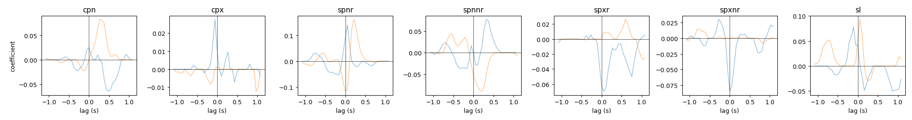

# Chantranupong reproduction — Gaussian, real photometry

Shows that **jaxGLM (`family="gaussian"`) reproduces the Sabatini-lab GLM engine on real fiber
photometry**. The reference is scikit-learn's `ElasticNet` — the engine the lab's
[`sglm`](https://github.com/bernardosabatinilab/sabatinilab-glm) (`model_type='Normal'`) wraps,
used for Chantranupong et al. 2023 (*Nature* 621:577). Both fit the **identical** design matrix,
so the comparison isolates the solver. jaxGLM's gaussian objective is identical to sklearn
ElasticNet's, so they should match at a real regularization (not just near the MLE).

## Data (public, no credentials)
One WT63 session from **DANDI 001767** (Chantranupong-2023-NWB), pulled anonymously:
- `sub-WT63/sub-WT63_ses-20211112_behavior.nwb` (~4 MB), 18.52 Hz, 264 photometry trials.
- Responses: z-scored detrended green photometry, both channels (ACh3.0 & dLight). Cached to netscratch.

## Design
Behavioral-event shift-kernels (±20 samples ≈ ±1.1 s, via [`design.build_design`](../design.py)),
predictors verified against the paper's `sglm` (`lynne_pp.py`): `cpn`/`cpx` (center poke in/out),
`spnr`/`spnnr`/`spxr`/`spxnr` (side poke in/out × reward), `sl` (side licks, L+R pooled).
`X` is (21628 × 287), `Y` is (21628 × 2).

## Run
Env `nwb` (dandi + pynwb + sklearn) for data/reference, `jaxGLM` for the fit.
```
python chantranupong/build_and_reference.py   # [nwb env]  NWB -> X/Y + sklearn ElasticNet reference
python chantranupong/compare_jaxglm.py        # [jaxGLM]   jaxGLM gaussian fit, compare, kernel plot
```

## Result
jaxGLM reproduces the sklearn/`sglm` reference per channel:

| metric | value |
|---|---|
| **R²** agreement (jax vs sklearn) | within **0.0007** (0.304/0.358) |
| **weight** correlation | **0.9963** |

The kernels explain ~30–36% of the green-signal variance. Kernel figure: `chantranupong_kernels.png`
(7 predictors × ±1.1 s lag, one line per channel).


