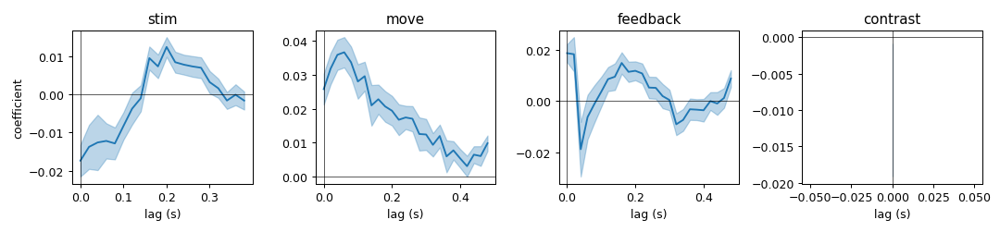

# IBL reproduction — Poisson, real spikes

Shows that **jaxGLM (`family="poisson"`) reproduces an independent, published Poisson-GLM fitter
on real Neuropixels data**. The reference is scikit-learn's `PoissonRegressor` — exactly the
engine IBL's [`neurencoding`](https://github.com/int-brain-lab/neurencoding) wraps. Both fit the
**identical** design matrix, so the comparison isolates the *solver* from design-matrix choices.

## Data (public, no credentials)
One International Brain Laboratory brain-wide-map session, pulled anonymously via the ONE API
(`openalyx.internationalbrainlab.org`):
- pid `56f2a378-78d2-4132-b3c8-8c1ba82be598`, eid `6713a4a7-faed-4df2-acab-ee4e63326f8d`
- 76 good units, 565 trials, spikes + trial events. Cached to netscratch.

## Design
Per-trial windows aligned to stimulus onset, 20 ms bins; FIR shift-kernels (via
[`design.build_design`](../design.py)) for **stimOn**, **firstMovement**, **feedback**, plus
**signed contrast**. `X` is (≈70k bins × 71 predictors), `Y` is binned spike counts.

## Run
Env `ibl` (ONE-api + ibllib + neurencoding + brainwidemap) for data/reference, `jaxGLM` for the fit.
```
python ibl/extract_session.py        # [ibl env]  download spikes + trials  -> session_raw.npz
python ibl/build_and_reference.py    # [ibl env]  build X/Y + sklearn PoissonRegressor reference
python ibl/compare_jaxglm.py         # [jaxGLM]   jaxGLM fit, compare, kernel plot
```
(On SLURM the two-env stages run in one job that switches conda envs.)

## Result
jaxGLM reproduces the sklearn/neurencoding reference per unit:

| metric | value |
|---|---|
| per-unit **D²** correlation | **1.0000** (max \|Δ\| 0.0007) |
| per-unit **weight** correlation | **0.9988** |

Kernel figure: `ibl_kernels.png` (per-event encoding kernels, mean ± s.e.m. across units).


